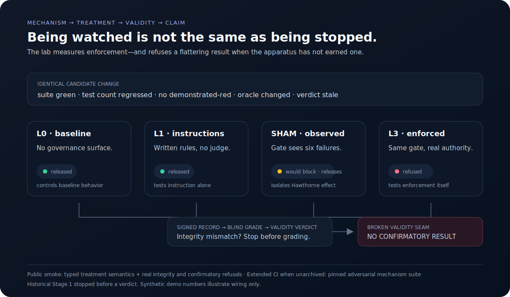

# Agent Governance Lab

**Does a real enforcement gate make an AI coding agent safer than written rules—or does
merely looking governed change behavior?**

This lab combines a deterministic enforcement treatment with the preregistered experiment
designed to measure it. Its central outcome is not a flattering effect size. Stage 1 stopped
without a confirmatory verdict because the apparatus had validated components in isolation
but had never run one real record through the full record → grade → analysis seam.

That refusal is the point: governance mechanisms should be measured, and the measurement
system should decline to manufacture a conclusion when its validity seam breaks.



## Run the argument in under 90 seconds

```bash
python -m pip install -e .
trustladder-smoke
```

Typical output:

```text
AGENT GOVERNANCE LAB — SYNTHETIC MECHANISM DEMO
same violation: SHAM observes/releases=True · L3 observes/releases=False
D3 integrity mismatch refused=True
confirmatory result=NO_CONFIRMATORY_RESULT
```

The smoke writes a machine-readable receipt and uses real production seams for both
refusals: the stage-B tree-integrity fence and confirmatory analysis's `VALID`-verdict
precondition. It fabricates no empirical treatment effect.

## The four-arm experiment

| Arm | Treatment | Why it exists |
|---|---|---|
| **L0** | Task only | Baseline behavior |
| **L1** | Task + written rules, no mechanical judge | Tests instruction alone |
| **SHAM** | The gate inspects and records exactly what L3 would block, but always releases | Separates being watched from being stopped |
| **L3** | The same deterministic gate has release authority | Tests enforcement itself |

In the public smoke, SHAM and L3 receive byte-for-byte equivalent evidence and produce the
same failure list. Only `released` differs. That makes the treatment contrast inspectable
instead of prompt-defined.

The full enforcement product remains [`3xit2_demo`](https://github.com/owieschon/3xit2_demo).
Rather than vendor and drift it, scheduled extended CI checks out pinned commit
`218d2dab8ebfa9c6e7a19f065e4a104b94d272d3` and runs its complete adversarial suite.
That exact commit was also re-run locally on 2026-07-10 in non-stamping CI mode: all 50
registered cases passed, including vacuous proof, stale green, oracle tampering, manifest
freeze, diff grounding, and untracked-content freshness.

## Why the study stopped

The historical Stage 1 run records were intact, but the frozen apparatus had three wiring
failures:

1. a variance probe was never dispatched;
2. a planned mini-replication was never built;
3. the runner and grader hashed terminal trees differently, so the integrity fence refused
   every real record before grading.

The calibration receipt was also a placeholder. Under maximum conflict of interest—the
experiment author also built the mechanism under test—hand-assembling a path around those
failures would have defeated preregistration. Grading stopped before any confirmatory
verdict, and the admissibility decision was escalated externally.

[`RESULTS.md`](RESULTS.md) is the concise case study. The public fixture now reproduces D3's
refusal and proves the repaired seam end-to-end, but it does not retroactively license a
result from the historical runs.

## What is executable here

- **Treatment semantics:** one typed gate distinguishes L1, SHAM, and L3 without relying on
  prompt prose.
- **Fast refusal smoke:** mechanism, D3 integrity failure, and no-validity/no-confirmatory
  behavior in well under 90 seconds.
- **Measurement pipeline:** signed hash-chained run records, blind grading, calibration,
  adjudication packets, validity gates, and structurally ordered confirmatory analysis.
- **Synthetic end-to-end run:** 32 stub-agent runs are signed, graded, chain-verified, and
  aggregated from actual verdicts—not hard-coded result rows.
- **Extended mechanism proof:** the full pinned 3xit2 adversarial suite runs on a schedule
  and by manual dispatch.

```bash
pytest -q                                      # fast local suite
trustladder-mini-run --workspace /tmp/mini    # synthetic sign → grade → aggregate
```

The synthetic mini-run deliberately plants a large L3-vs-L1 difference to show that the
pipeline can recover a known signal. It is an illustration, not a finding about real agents.

## Start reading here

[`docs/READING_PATH.md`](docs/READING_PATH.md) maps a four-file vertical slice:

1. `src/trustladder/governance/gate.py` — the enforcement treatment;
2. `src/trustladder/demo/lab_smoke.py` — the reviewer path and receipt;
3. `src/trustladder/analysis/analysis.py` — validity before confirmatory;
4. `tests/test_grading_seam.py` — the decisive broken seam, repaired and tested.

The broader design is in [`METHODOLOGY.md`](METHODOLOGY.md) and
[`ARCHITECTURE.md`](ARCHITECTURE.md).

## Claim boundaries

- **No empirical treatment effect is claimed.** Historical Stage 1 produced no admissible
  confirmatory verdict.
- The public smoke and mini-run are synthetic; they prove wiring and refusal behavior, not
  how real agents respond.
- The real task battery, raw transcripts, private preregistration, and session identifiers
  are excluded. No private code, customer data, PII, or secrets are required.
- The full 3xit2 mechanism is a separate public prototype with a cooperative-agent threat
  model, not a security sandbox. This lab pins and tests it; it does not widen that claim.

See [`docs/SOURCE_PROVENANCE.md`](docs/SOURCE_PROVENANCE.md) for the exact source and
publication boundary.

Apache-2.0 — see [`LICENSE`](LICENSE).
